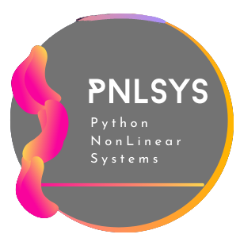
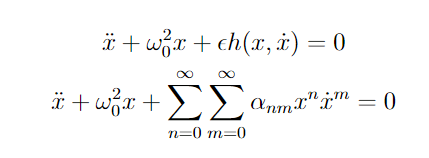
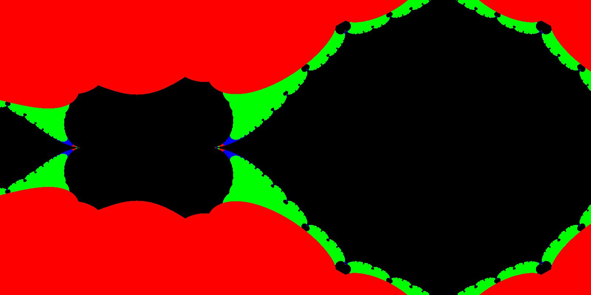

<h1 align="center">
  <a href="https://github.com/smallpondtom/pnlsys">
    <!-- Please provide path to your logo here -->
    
  </a>
</h1>


<div align="center">

[](LICENSE)
[](https://github.com/smallpondtom/pnlsys/issues?q=is%3Aissue+is%3Aopen+label%3A%22help+wanted%22)
[](https://github.com/smallpondtom)
</div>

<div align="center">
  <a href="https://github.com/smallpondtom/pnlsys/issues/new?assignees=&labels=bug&template=01_BUG_REPORT.md&title=bug%3A+">Report a Bug</a>
  ·
  <a href="https://github.com/smallpondtom/pnlsys/issues/new?assignees=&labels=enhancement&template=02_FEATURE_REQUEST.md&title=feat%3A+">Request a Feature</a>
  .
  <a href="https://github.com/smallpondtom/pnlsys/issues/new?assignees=&labels=question&template=04_SUPPORT_QUESTION.md&title=support%3A+">Ask a Question</a>
</div>

<details open="open">
<summary>Table of Contents</summary>

- [About](#about)
  - [Built With](#built-with)
- [Getting Started](#getting-started)
  - [Installation](#installation)
- [Usage](#usage)
- [Possible Improvements](#possible-improvements)
  - [Work in Progress](#work-in-progress)
  - [Future Features](#future-features)
  - [Quick Fix](#quick-fix)
- [Support](#support)
- [Project assistance](#project-assistance)
- [Contributing](#contributing)
- [Authors & contributors](#authors--contributors)
- [License](#license)
- [Courtesy](#Courtesy)

</details>

---

## About


Nonlinear dynamics analysis python tool. Features include phase plots, 
duffing system, bifurcation, nonlinear approximation methods, etc.

<h3 align="center"> Python + Nonlinear Systems = pNLsys</h3>

<div align="center">
  <a href="https://github.com/smallpondtom/pNLsys/blob/main/plots/juliaSetCompressed.gif">
    <!-- Please provide path to your logo here -->
    
  </a>
</div>


### Built With

This project is based on nonlinear dynamics and analysis referenced mainly from Nayfeh and Mook. 
The goal of this project is to provide a strong set of tools to analyze nonlinear dynamical
systems using techniques and theories such as 

- Hamilton's principle 
- Discretization techniques 
- Phase plane analysis 
- Local stability analysis of (nonlinear) equilibria (fixed points)
- Bifurcation analysis of fixed points
- Weakly nonlinear oscillations and perturbation analysis
  - Conservative systems
  - Nonconservative systems - damped and forced 
- Parametrically excited systems 
  - Averaging
  - Lindstedt-Poincare
  - Multiple Scales
  - Harmonic Balance
  - Floquet Theory
  - Homotopy Techniques 
- Quasiperiodic solutions
- Poincare sections and maps 
- Introduction to chaos and fractals
- Classical routes to chaos 

## Getting Started

### Installation

1. Installing Anaconda from [here](https://www.anaconda.com/) and Git
from [here](https://git-scm.com/downloads).
2. Create a new conda environment with required packages (will not setup from a 
.txt or .yml file to avoid conflicts occurring from the use of different OS).

```
conda create --name pythononlinear python>=3.8 numpy pandas matplotlib sympy jupyter jupyterlab
```

3. Activate the new environment and add packages you might want to have.

```
conda activate pythononlinear
conda install -c conda-forge control 
```

4. Clone this repository to your desired location.

```
git clone https://github.com/smallpondtom/pNLsys.git
```

5. Navigate to the notebook directory inside pNLsys and open up Jupyter Lab.

```
cd pNLsys/notebooks
jupyter lab 
```

6. Alternatively you can just download the Jupyter notebook files and open them 
with Google Colaboratory which is a free Jupyter lab like platform where you can
code and execute Python. [Learn more](https://research.google.com/colaboratory/).

## Usage

You can simply run the Jupyter notebooks and see the demonstrations of nonlinear 
dynamics done in Python language.

For Georgia Institute of Technology students, you are more than welcome to use this 
project for your studies and improve upon it. Especially if you are taking the 
Mechanical Engineering Course ME6444 Nonlinear Systems.

Furthermore, it would be heavily appreciated if you could point out mathematical 
or even theoretical mistakes in this repository so that I can fix them. Or if you 
would like, you can go ahead and fork this repository and fix it yourself. Once you do
you can create a pull request as noted in the [Contributing](#contributing) section.

## Possible Improvements

### Work in Progress

Currently, I am working to create a python library called `pNLsys` based on the 
Jupyter notebooks in this repository. 

### Future Features

- One great feature to add to this project is expanding the `DEplot` function to
a more general use case. Currently, this function only supports second order, single
variable ODEs and cannot plot the phase plane for multivariate higher order differential
equations.

- Another improvement would be to create a new function which approximates the nonlinear 
parametrically excited system using the methods covered in the notebooks such as averaging,
Lindstedt-Poincare, etc. This function would take an input which could be any general kind of 
excited system in the form shown below (also the Taylor expanded form). The function will perform 
an approximation indicated by another function argument using Sympy and return the approximated 
equation.

<div align="center">
  <a href="https://github.com/smallpondtom/pNLsys/blob/main/docs/images/latex1.png">
    
  </a>
</div>

- Pertaining to chaotic systems, it would be ambitious to create a python library that
specializes in chaotic system identification and its analysis using the techniques studied 
in the ME6444 (course at Georgia Tech) as well as other effective theories and techniques.

### Quick Fix

See the [open issues](https://github.com/smallpondtom/pnlsys/issues) for a list of proposed features (and known issues).

- [Top Feature Requests](https://github.com/smallpondtom/pnlsys/issues?q=label%3Aenhancement+is%3Aopen+sort%3Areactions-%2B1-desc) (Add your votes using the 👍 reaction)
- [Top Bugs](https://github.com/smallpondtom/pnlsys/issues?q=is%3Aissue+is%3Aopen+label%3Abug+sort%3Areactions-%2B1-desc) (Add your votes using the 👍 reaction)
- [Newest Bugs](https://github.com/smallpondtom/pnlsys/issues?q=is%3Aopen+is%3Aissue+label%3Abug)

</br>
<div align="center">
  <a href="https://github.com/smallpondtom/pNLsys/blob/main/plots/MandelBrot_sinusoid.jpg">
    
  </a>
</div>
</br>


## Support


Please reach out to:

- [GitHub issues](https://github.com/smallpondtom/pnlsys/issues/new?assignees=&labels=question&template=04_SUPPORT_QUESTION.md&title=support%3A+)
- Contact options listed on [this GitHub profile](https://github.com/smallpondtom)

## Project assistance

If you want to say **thank you** or/and support active development of pNLsys:

- Add a [GitHub Star](https://github.com/smallpondtom/pnlsys) to the project.
- Write interesting articles about the project on [Dev.to](https://dev.to/), [Medium](https://medium.com/) or your personal blog.

Together, we can make pNLsys **better**!

## Contributing

If you would like to contribute to this project please go ahead and fork this project and create a pull request to the original repository. I will be actively monitoring this project and will incorporate any great new improvements from motivated folks.

Please read [our contribution guidelines](docs/CONTRIBUTING.md).
I appreciate the contribution.

## Authors & contributors

The original setup of this repository is by [Tomoki Koike](https://github.com/smallpondtom) a Georgia Tech AE graduate student.

For a full list of all authors and contributors, see [the contributors page](https://github.com/smallpondtom/pnlsys/contributors).

## License

This project is licensed under the **MIT license**.

See [LICENSE](LICENSE) for more information.

## Courtesy 

> **[1]**
> Dr. Micheal Joseph Leamy, ME6444, Georgia Institute of Technology.
>
> **[2]** Nayfeh and Mook, 2004, *Nonlinear Oscillation*.
>
> **[3]** Nayfeh and Balachandran, 2004, *Applied Nonlinear Dynamics*.
>
> **[4]** Stephen Lynch, 2001, *Dynamical Systems with Applications Using Maple*.
